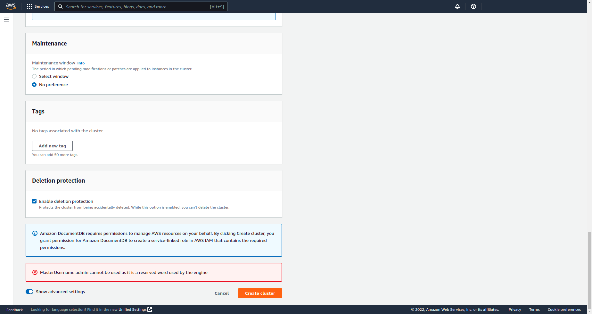

# LABORATORY-AWS-DMS

As I am working on my different aws certification. I am also testing how to use the different tool provided by **AWS**. This laboratory was created for testing how to migrate a database from a server to a documentDB using **DMS**, database migration service. I have documented with screen at each step how to do this. This is quite a long process but the result is perfect without any faulty copy.

## Plan of the presentation

I explain with all the details how I build the project and my way of working.

- [Create a DocumentDB Cluster](#create-a-documentDB-cluster)
- [Modification on EC2](#modification-on-ec2)
- [Create a replicate instance](#create-a-replicate-instance)
- [Create endpoints](#create-endpoints)
- [Create Database Migration](#create-database-migration)
- [Test](#test)
- [System](#System)

#### Create a DocumentDB Cluster

Login on AWS and search for DocumentDB. Click on the button `Create Cluster`




#### Modification on EC2

When going on the cluster of your DocumentDB, you should see the following information:


Connect to your ec2 using SSH and use the first command of the previous screen to download the certficate.


If you are using UFW, open the port 27017 using the command:

```bash
sudo ufw enable 27017
```


In the security group, open the port 27017


Change the network of the mongodb in the mongod file.

```bash
sudo nano /etc/mongod.conf
```


Modify the network interface line with the ec2 url inside `bindIp`.


And finally, restart the mongo service.


#### Create a replicate instance

Search for DMS and click on the button `Create replicate instance`


#### Create endpoints

Create the source endpoint which represent the mongodb inside the ec2.


And test the endpoints.


Create the target endpoint which represent the cluster documentDB.


#### Create Database Migration

Go in the AWS DMS and click on the button `Create task`.


The migration should now start. It might take a while.


Once done, the status of the migration will change.


#### Test

Connect to the documentDB Cluster and check if the database contains all the data.


Alternatively, you can check the result of the migration in DMS in the tab `table statistics`.


## System

Ubuntu Version: Ubuntu 20.04.1 LTS
Node Version: v16.17.3

```bash
# Get the version of node
$ node -v

# Get the latest version of ubuntu
$ lsb_release -a
```